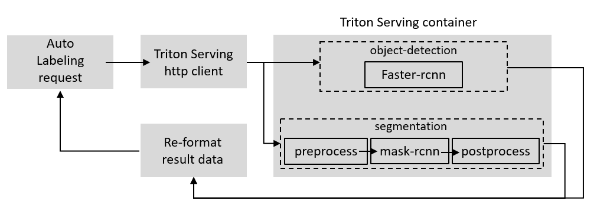

# solution-ai-model
> auto-labeling AI Back-end 개발

모델 서빙 서버 및 클라이언트 개발 with Triton 



## version compatibility

```sh
OS : Ubuntu 18.04
GPU : Geforce RTX 3090 (2EA) 
nvidia driver (nvidia-driver-470)
cuda(11.3)
cudnn(8.2.1)
pytorch(1.11.0)
docker (v20.10.17)
nvidia-docker
detectron2(v0.6)
triton server(2.12.0)
```

## requirements
```sh
torch==1.11.0+cu113
torchaudio==0.11.0+cu113
torchvision==0.12.0+cu113

tqdm==4.64.1
tritonclient[all]
Pillow==9.2.0
numpy==1.23.2
Shapely==1.8.4
opencv-python==4.6.0.66
multidict==6.0.2
pycocotools==2.0.4
```

## download models
```sh
mkdir checkpoints
cd checkpoints
```
download .pkl file from [here] (https://drive.google.com/drive/folders/1iThtzq1aKOaLnbExZe6Zsy8Kv0-l7Dr0) and [here](https://drive.google.com/drive/folders/13Bfn7B6bkiKopv-3OOqf2O14elJ4I0ul)
after download, place .pkl file to checkpoints/

#downdload torchscript model for serving
[faster-rcnn model](https://drive.google.com/drive/folders/1YqmH7f5pDmfLgZFqcE4iBQPaORnpKrgW),[mask_rcnn model](https://drive.google.com/drive/folders/1ySaej3dVPBVPQBRJZAabHX2wZF555tlr)
and place each files into models/faster_rcnn/1/ , models/mask_rcnn/1/  

