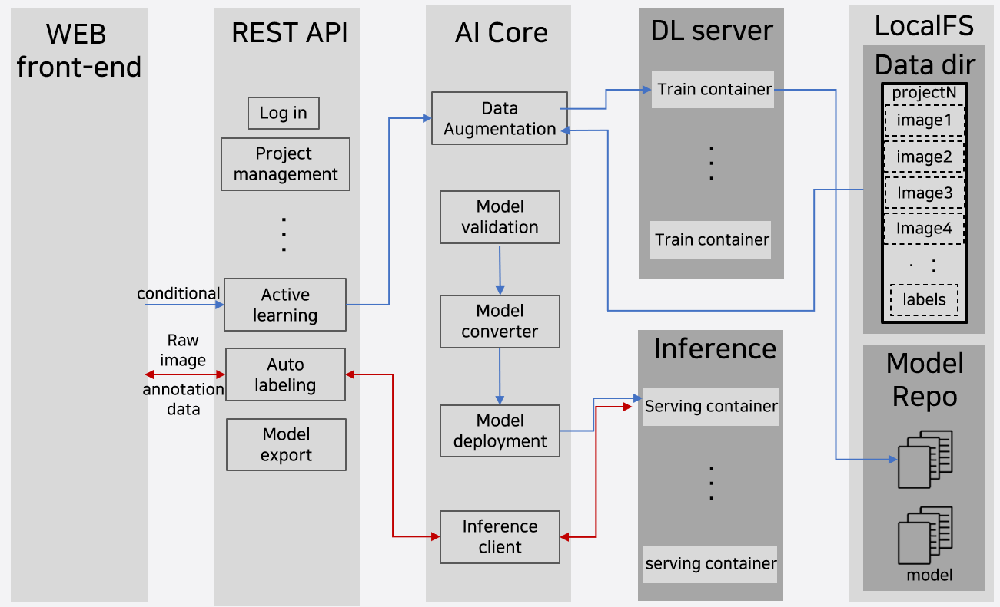
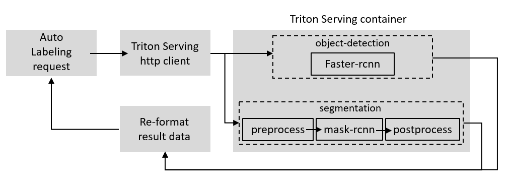
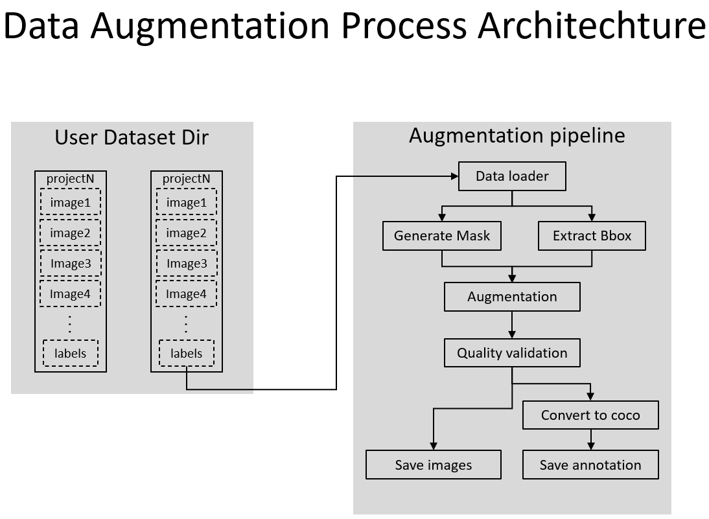

# solution-ai-model
> auto-labeling AI Back-end 개발

AI core 아키텍쳐


모델 서빙 서버 및 클라이언트 개발 with Triton 


데이터 증강 프로세스


docker hub [URL](https://hub.docker.com/repository/docker/tbelldev/sslo-ai)

## version compatibility

```sh
OS : Ubuntu 18.04
GPU : Geforce RTX 3090 (2EA) 
nvidia driver (nvidia-driver-470)
cuda(11.3)
cudnn(8.2.1)
pytorch(1.11.0)
docker (v20.10.17)
nvidia-docker
detectron2(v0.6)
triton server(2.12.0)
```

## pytorch & detectron installation info(Don't need to install)
### pytorch
```sh
pip install torch==1.11.0+cu113 torchvision==0.12.0+cu113 torchaudio==0.11.0 --extra-index-url https://download.pytorch.org/whl/cu113
```
### detectron2
```sh
python -m pip install detectron2 -f \
  https://dl.fbaipublicfiles.com/detectron2/wheels/cu113/torch1.10/index.html
```

## requirements
```sh
tqdm==4.64.1
tritonclient[all]
Pillow==9.2.0
numpy==1.23.2
Shapely==1.8.4
opencv-python==4.6.0.66
multidict==6.0.2
pycocotools==2.0.4
albumentations==1.3.0
```

## download models
```sh
mkdir checkpoints
cd checkpoints
```
download .pkl file from [here](https://drive.google.com/drive/folders/1iThtzq1aKOaLnbExZe6Zsy8Kv0-l7Dr0) and [here](https://drive.google.com/drive/folders/13Bfn7B6bkiKopv-3OOqf2O14elJ4I0ul)
after download, place .pkl file to checkpoints/

# downdload torchscript model for serving
[faster-rcnn model](https://drive.google.com/drive/folders/1YqmH7f5pDmfLgZFqcE4iBQPaORnpKrgW),[mask_rcnn model](https://drive.google.com/drive/folders/1ySaej3dVPBVPQBRJZAabHX2wZF555tlr)
and place each files into models/faster_rcnn/1/ , models/mask_rcnn/1/  

# Run
```sh
python inference.py --image {image path} --model {faster_rcnn/infer_pipeline} --task {od/seg} --conf {float type ex.0.67 , 0.89} --class_name person --serving-port 8000
```
